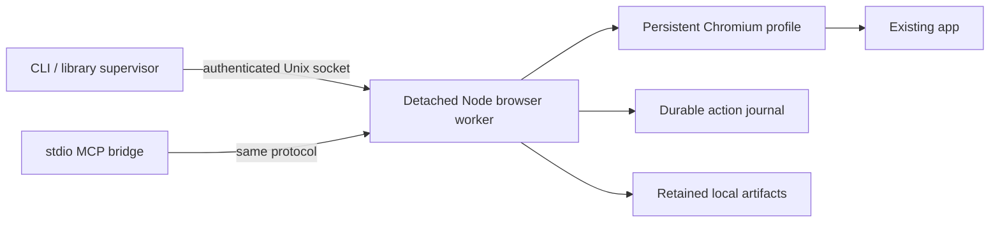

# Architecture and upstream assessment

## Process boundary

The alpha's local supervisor is a library function that launches or verifies the worker. There is no extra supervisor daemon yet. The detached worker owns the Playwright context and socket, so the MCP process can exit without owning Chromium's lifetime. Session UUID and start timestamp come from the authenticated worker; a PID is diagnostic information, not proof of ownership.

The socket is bound before Chromium starts to arbitrate launches. Unknown existing sockets are left intact. Automatic stale-socket repair and surviving-worker attachment by a future supervisor daemon remain separate release gates.

## Action journal

Intent is written and synced before dispatch. State is written atomically via a temporary file and rename. Mutations have a caller request ID and canonical parameter hash; plaintext fill values and upload bytes are not recorded. Per-tab leases reject concurrent mutations. Transport loss never causes automatic replay. Interrupted dispatch intent becomes `outcome_unknown` when a journal is loaded again.

There is no exactly-once business-operation guarantee: the browser or app can perform an action before the local observation becomes durable. A failed journal disables further mutations. Cancellation and full crash-injection coverage are still planned.

## Playwright MCP

Reviewed the [public exported API](https://github.com/microsoft/playwright-mcp/blob/main/index.d.ts): `createConnection(config?, contextGetter?)` accepts an existing browser context. Reusing it is viable for ordinary MCP browser exposure. It does not expose a public per-action journal/dispatch middleware contract. Routing Litewave mutations through it would leave Litewave unable to enforce its durable request-ID contract uniformly across CLI, library, and MCP.

Decision: compose public Playwright browser APIs and the official MCP SDK. Do not import Playwright MCP's internal snapshot or tool modules. This alpha uses `ariaSnapshot()` without reference IDs. Upstream is Apache-2.0; no source was copied.

## Tidewave Phoenix

The [Tidewave Phoenix repository](https://github.com/tidewave-ai/tidewave_phoenix) provides useful patterns for a small development Plug, runtime docs/source discovery, capability discovery, and supervised log capture. It is Apache-2.0 and can be used as a standalone runtime MCP server.

Reviewed its [Plug](https://github.com/tidewave-ai/tidewave_phoenix/blob/main/lib/tidewave.ex), [application supervisor](https://github.com/tidewave-ai/tidewave_phoenix/blob/main/lib/tidewave/application.ex), [logger](https://github.com/tidewave-ai/tidewave_phoenix/blob/main/lib/tidewave/mcp/logger.ex), and [Ecto tool](https://github.com/tidewave-ai/tidewave_phoenix/blob/main/lib/tidewave/mcp/tools/ecto.ex). Litewave's planned adapter can follow the runtime-discovery approach. Its read-only SQL policy needs a dedicated restricted connection and transaction; limiting returned rows does not prevent mutations or bound database execution.

Litewave's independent browser does not require embedding the app in a control page. Its Plug handles only its own authenticated endpoint. The adapter now implements those runtime capabilities in `packages/phoenix`. `lib/litewave/introspection.ex` adapts Tidewave Phoenix 0.9.0 source lookup/doc helpers with Apache-2.0 attribution and license retained. References are resolved against known modules/functions without creating atoms from arbitrary user input. SQL currently follows explicitly enabled read-write parity; enforced read-only access remains a separate milestone.

## Versions

Node 24.21.0 LTS; Playwright 1.62.0; Chromium 151.0.7922.34, Playwright revision 1234; MCP SDK 1.30.0. Exact dependencies and integrity hashes are in `package-lock.json`. Browser installation is explicit. Original code is MIT; published as npm `litewave` and Hex `litewave_phoenix`.

## Phoenix connection

The stdio MCP bridge reaches the project's runtime directly, not through the browser worker. By default it reads `projects/<key>/runtime.json` under `LITEWAVE_HOME`, checks that the run directory and socket are owned by the current user, and connects to the Unix socket the `litewave_phoenix` application published at boot. If the descriptor is absent, or the socket refuses before anything was sent, and `phoenix.json` exists, it falls back to the authenticated loopback `/litewave/runtime` endpoint served by the optional `Litewave` Plug. Each execution carries a runtime identity and request ID; the supervised runtime tracks duplicates within that lifetime and refuses old identities after restart.

The browser pin is qualified with stock Playwright launch settings. `src/profile.ts` rejects an accidental driver upgrade before opening a profile and prevents newer-profile downgrades; replacement is explicit, with optional storage-state import. `src/profile-ownership.ts` permits normal Chromium startup through a leftover lock only when it matches the registration's persisted closed session and the recorded local owner process is absent. Otherwise it fails closed. No lock is unlinked by Litewave. Stop waits for Playwright's bounded termination and the durable ownership record, reports elapsed time, and rejects new tab actions while closing. Completed artifacts and interrupted transfer records are reloaded independently of a worker's lifetime.
