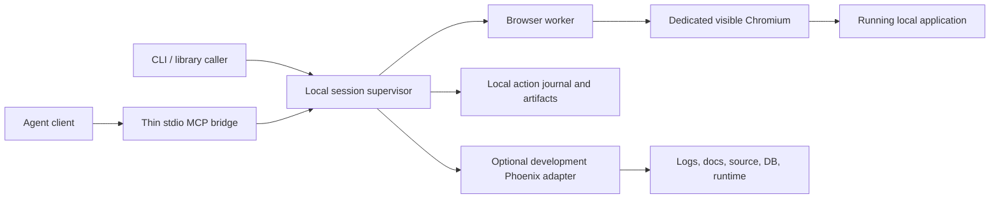

# Local browser and Phoenix access — implementation specification

Status: proposed build specification, 15 September 2026. Working label: Local Access; package names must be checked before publication. This document authorizes no deployment or dependency changes. The user requested a thorough specification; implementation has not started.

## 1. Product decision

Build a free, open-source library and local service that lets an agent operate a real browser, collect evidence, and inspect a running Phoenix application. It must work without a vendor account, hosted relay, paid API, or browser control page that has to remain open.

The first acceptance exercise is Langelic's PDF-to-EPUB conversion: upload a PDF, choose reflow without translation, observe preparation, download the EPUB, and retain enough evidence to evaluate the experience and output. Browser operations must work for React/Inertia, LiveView, and ordinary server-rendered pages.

The primary deliverable is reliable local access. It does not decide whether an EPUB is good, contain a model, or require an agent subscription of its own. The calling agent performs the evaluation using returned evidence.

### Non-negotiable outcomes

- No tool-vendor login, renewal, or network authentication dependency.
- Existing application authentication persists in a dedicated browser profile. App login may still expire under the app's own rules.
- Restarting the agent connection does not close the browser or discard downloads.
- Closing an optional status window does not disconnect control.
- Upload, download, screenshot, select, and wait are first-class operations.
- A lost response is never reported as a successful click or failed business operation without evidence.
- No automatic application-server restart, browser killing, profile-lock deletion, or database mutation as recovery.

## 2. Evidence motivating the build

During the current evaluation, the app responded at localhost:4444 while Tidewave browser control was unavailable. Vendor login interrupted the task; session IDs disappeared after navigation/reconnection; control disconnected during an export click. Reopening the control page sometimes helped and later did not. Even after the user's latest reconnect attempt, two new-session requests returned no connected browser.

The exact underlying cause of these disconnects is unverified. The replacement must expose enough diagnostics to distinguish authentication, browser ownership, transport, and app failures rather than assume they share one cause.

The separate Chrome tool also reported an occupied automation profile. We could operate the file input only by constructing a File/DataTransfer object in page evaluation. Several actions returned before React updated its view. The current documented Tidewave browser API provided no dedicated screenshot, upload, or download-capture operation.

The timed-out export click created no new source export at the time of a read-only database check. That is an observation about this attempt, not a general guarantee that timed-out clicks have no effect.

## 3. Scope and release boundaries

| Release | Required scope |
| --- | --- |
| First usable release | macOS; dedicated visible Chromium profile; browser library, local supervisor, CLI/MCP bridge; snapshots, interactions, file handling, evidence, reconnect and action journal |
| Phoenix integration | Development-only Mix dependency exposing logs, docs, source locations, explicit runtime evaluation, and read-only SQL; Langelic worktree identity |
| Later compatibility | Linux CI; qualified attachment to an existing Chromium debugging endpoint; Firefox/WebKit adapters; Windows packaging |

Chromium is the initial supported browser because it provides a bounded implementation target. This is not a claim that Playwright can attach to the current Safari window. Safari application-session reuse needs a separate adapter and is deferred. A user signs into Langelic once in the dedicated browser; do not copy cookies out of their everyday browser.

Out of scope: a general desktop automation framework, remote browser hosting, a recorder UI, a replacement for every Tidewave feature, an LLM orchestration framework, automatic app repairs, automatic login bypass, and built-in EPUB conversion.

## 4. Architecture



### Packages and responsibilities

1. **TypeScript core library:** typed requests/results, session registry, artifact handling, action lifecycle, capability checks. No model dependencies.
2. **Browser adapter:** uses public Playwright APIs for browser interaction. Do not invent a selector engine, browser driver, or file-transfer protocol where Playwright already supplies one.
3. **Local supervisor:** owns long-lived workers and the session registry. A lightweight MCP bridge can exit without terminating it. Explicit `stop` is distinct from client detach.
4. **CLI and MCP adapter:** expose the same core functions. Structured results must agree across both interfaces; no separate business logic.
5. **Optional Elixir dependency:** development-only runtime access. The browser remains usable when this adapter is absent or the app is down.

Use a user-owned Unix socket for local bridge-to-supervisor communication on macOS. Prefer this to an unauthenticated TCP listener. A future network transport is a separate feature. The Phoenix integration may use a loopback endpoint protected by a local token because it lives inside the running application.

Use a pinned Playwright version and supported Node LTS release. Select exact versions during implementation and record them in a lockfile. Browser binaries must be explicitly installed; runtime must not silently download upgrades.

### Reuse assessment

Evaluate the existing Playwright MCP server as a baseline before implementing tool wrappers. It already exposes browser automation through MCP. Reuse a supported library surface where available; otherwise compose public Playwright APIs. Do not depend on undocumented internal modules or fork a large codebase to add session ownership. The distinct work here is durable local sessions, honest action outcomes, retained artifacts, and optional Phoenix access. [Playwright MCP](https://github.com/microsoft/playwright-mcp)

Playwright documents persistent profiles and Chromium CDP attachment, and warns that CDP attachment has lower fidelity than its native connection. The initial worker owns its Playwright browser; existing-browser attachment is qualified separately rather than assumed equivalent. [BrowserType](https://playwright.dev/docs/api/class-browsertype)

## 5. Setup and everyday use

The following command names describe the proposed interface; they are not installed commands.

```text
local-access init --app http://localhost:4444 --project /path/to/project
local-access browser open
local-access status
local-access mcp
local-access doctor
local-access stop
```

`init` writes a local project registration and prints the MCP configuration. It must not overwrite existing configuration. `browser open` starts or reuses the project browser. The user signs into the application using its normal UI. `mcp` attaches the current agent to the supervisor. `doctor` reports problems and concrete remedies without performing destructive recovery.

An optional status window shows app URL, project/worktree, selected tab, browser owner, connection age, pending actions, and artifact directory. It contains no required authentication flow and can be closed freely.

Default to one profile per explicit project registration, with distinct worktree registrations. Key identity by canonical directory plus a generated registration ID; never select a project solely by basename or port. Track expected app origin independently. Sharing a browser profile across worktrees must be an explicit choice, not a cookie-copy operation.

## 6. Session ownership and recovery

Persist logical session ID, project registration, browser-worker identity, profile path, app origin, adapter version, and last observed status. A PID alone is insufficient proof of ownership; verify the worker handshake and process start identity.

Connection states:

```text
starting -> ready -> reconnecting -> ready
                       |             |
                       v             v
                 needs_attention   closed
```

Report app reachability, adapter connectivity, tab availability, and application login separately. A login page can be a perfectly healthy browser connection.

- MCP-client restart: reconnect to the same supervisor and worker; enumerate existing tabs.
- Navigation/reload: preserve logical tab identity, increment document revision, invalidate old snapshot references.
- Browser exit: report browser_closed. Offer to reopen the dedicated profile; do not claim the old tab or JS state survived.
- Supervisor restart: reconnect to a surviving authenticated worker when possible. Otherwise declare the old session interrupted and open a replacement only through the normal browser-open policy. Never promise browser survival through an untested process model.
- Occupied profile: reuse it only after verified ownership. For an unknown owner return profile_in_use with remedies; never remove lock files or kill a browser automatically.
- Machine sleep: resume health checks and reconnect with bounded backoff. Report the actual outcome rather than showing an indefinite spinner.

Use a five-second worker heartbeat and consider three missed heartbeats degraded. Retry transport attachment after 0.5, 1, 2, and 4 seconds, then return an actionable state. These are initial defaults, configurable and verified by fault tests.

## 7. Browser tool contract

Every tool returns a common envelope: protocol version, request ID, session ID, logical tab ID, document revision, status, duration, typed result, warnings, and structured error. Use bounded output with cursors. Advertise capability support on connection; unsupported operations fail before side effects.

| Tool group | Operations and guarantees |
| --- | --- |
| Sessions | status, list, open, attach, detach, explicit close; no silent selection of another user's tab |
| Tabs | list, create, select, close, navigate, back, forward, reload; report popups as new tab IDs |
| Inspection | accessibility snapshot, screenshot, element geometry; scoped output, revision-bound references |
| Interaction | click, fill, select options, check/uncheck, keypress, hover, scroll, drag; actionability checks and unique target resolution |
| Waiting | visible/hidden element, text, URL, app condition, download; timeout and cancellation; no fixed sleep requirement |
| Files | upload from allowlisted path, arm download capture, inspect/save artifact, list completed downloads |
| Diagnostics | console entries, request failures, bounded response metadata, trace on demand |
| Advanced | page evaluation as an explicit capability; marked separately from ordinary interaction |

Locators support role plus accessible name, test ID, snapshot reference, and explicit CSS when necessary. Ambiguous matches return target_ambiguous with a small candidate list. Never guess the first match. Snapshot references expire across document changes; an expired reference returns stale_snapshot and a new scoped snapshot.

Handle iframe targets explicitly and report inaccessible frames. Support open shadow DOM through the adapter; closed roots and browser-native dialogs require documented limitations. Report JS dialogs with accept/dismiss/respond actions. No automatic acceptance of confirmations.

An action may include a postcondition, such as a visible heading or a download start. Arm listeners before dispatch. Actionability is not application completion: results distinguish dispatch from the postcondition being observed. Do not use network-idle as the universal readiness test, since LiveView and background polling can keep connections open.

Suggested defaults: five seconds for target resolution, ten seconds for ordinary postconditions, and 30 seconds for navigation. Long business jobs return a handle and permit bounded status waits; they must not monopolize a tool call for minutes.

## 8. Honest action outcomes

Assign each mutating action a caller-supplied request ID and persist its parameter hash before dispatch. Journal states:

```text
accepted -> dispatching -> dispatched -> postcondition_met
                  |             |
                  +------> outcome_unknown
accepted -> rejected_before_dispatch
```

Persist state transitions before acknowledging them. `action_status(request_id)` retrieves the durable observation. Reusing an ID with different parameters is an error; reusing it with identical parameters returns the prior action rather than dispatching again.

There is an unavoidable crash window between recording intent, sending a browser event, and observing the app. This library cannot guarantee exactly-once business operations. On a crash in that window return outcome_unknown. Do not replay a submit, purchase, import, or export click automatically. Read-only status checks or app-supported idempotency may resolve uncertainty; otherwise surface it clearly.

Serialize mutations per tab. A second client receives tab_busy or explicitly acquires a lease. Inspections may proceed if they report their observed revision. Cancellation stops waiting and queued operations; it cannot undo a dispatched action. Client disconnection does not cancel a potentially running app operation.

Required error codes include browser_closed, connection_lost, app_unreachable, profile_in_use, target_not_found, target_ambiguous, stale_snapshot, postcondition_timeout, outcome_unknown, unsupported_capability, path_not_allowed, download_failed, and permission_denied. Each includes what is known, whether dispatch occurred, and a suggested next operation.

## 9. Uploads, downloads, and evidence

### Uploads

Accept absolute local paths within configured upload roots. Resolve symlinks before checking boundaries. Set files through the browser adapter's real input/file-chooser support. Confirm filename, size, and input target; distinguish file selection from successful server import. Support multiple files when the input allows them, replacement, cancellation, and a failed application validation.

Never embed full PDF bytes in model-visible tool arguments. Native OS chooser appearance is a separate manual/UI test; adapter file selection must not be represented as testing that dialog.

### Downloads

Register capture before clicking. Return an action handle immediately, then completion status including local path, suggested and final filename, size, SHA-256, content type when known, and originating tab/action. Save artifacts outside temporary browser storage before reporting complete. Playwright's guide notes download files can be removed when their browser context closes, making explicit saving essential. [Downloads](https://playwright.dev/docs/downloads)

Write to a partial file, finalize atomically, sanitize filenames, and choose a collision-safe destination. Zero-byte and truncated files are failures or explicit anomalies, never silent success. Handle browser-reported cancellation and disk-full errors. Interrupted downloads remain failed/unknown; resumability is not promised in the first release. A new download click requires a new explicit action.

### Evidence bundle

Store a manifest with project, session, action IDs, UTC timestamps, browser version, viewport, and relative artifact paths. Include screenshots, bounded snapshots, relevant console/network errors, source/output file hashes, and action outcomes. Retain the original downloaded EPUB unchanged; unpacking or rendering creates derived artifacts.

Screenshots support viewport, full-page, element crop, and coordinate scale. Record CSS and image dimensions for reliable pointer actions. Coordinate clicks are an explicit fallback tied to screenshot revision and viewport. Mask password fields by default; arbitrary private content requires configured masks and user review before sharing.

Store artifacts locally, never upload them automatically. Default retention: seven days for diagnostic logs; completed downloads and explicitly saved reports persist until deletion. Make cleanup inspectable and restrict it to owned directories. Apply a configurable capture budget; exceeding it disables additional diagnostics without deleting completed outputs.

## 10. Phoenix adapter

Provide a small optional Mix dependency enabled only in development. Configuration specifies project identity, endpoint, allowed capabilities, workspace roots, and local token location. Enabling it may require the user to restart their app once; the library never starts or restarts the app itself.

Required operations:

- Logs: bounded ring buffer, severity/filter/cursor, explicit gap detection after overflow, and correlation with known requests/jobs where available.
- Documentation: module/function docs and source location, restricted to project and declared dependency roots.
- SQL: dedicated read-only PostgreSQL transaction/connection, statement timeout, row and byte limits. String checks for SELECT are not a sufficient security boundary; functions can have effects. Prefer a restricted DB role where available. Expose no write-SQL tool by default.
- Runtime evaluation: separate opt-in capability, executed in a supervised task with time/output limits. Arbitrary Elixir evaluation can mutate state and is not a sandbox. Killing a task does not undo effects; label uncertainty honestly.
- Health: app identity, environment, endpoint, versions, adapter status. Refuse production mode by default.

Do not ship Langelic-specific workflow queries in the general adapter. Job observations should be opt-in integrations over supported app APIs. When implementing HTTP calls in Langelic or its Elixir integration, use Req.

## 11. Local security and privacy

The agent has substantial control over the selected browser and optional runtime. No-account access must still be scoped to the local user.

- Owner-only socket, profile, token, journal, and artifact directories; verify peer identity where supported.
- Any HTTP adapter binds loopback, validates Host and Origin, rejects wildcard CORS, and checks a local secret. Follow the applicable MCP transport requirements if exposing Streamable HTTP. [MCP transports](https://modelcontextprotocol.io/specification/2025-11-25/basic/transports)
- Tokens never enter page URLs, snapshots, logs, or model output. No telemetry by default.
- Default navigation scope is the registered app; explicitly configured authentication origins permit normal app sign-in. Never silently expand access to unrelated tabs or origins. Do not confuse navigation controls with a complete browser-network firewall.
- File access is limited to configured roots. Downloads cannot overwrite arbitrary paths or escape through symlinks.
- Network diagnostics redact cookies, authorization headers, and signed query parameters by default. Response bodies and full traces require explicit capture configuration.
- Page text and tool output are untrusted content, never instructions that grant capabilities. Permission decisions belong to the client and local configuration.

## 12. Acceptance tests and release gates

All performance numbers below are targets to measure on a documented reference machine, not claims about current implementation.

| Scenario | Pass condition |
| --- | --- |
| Fresh setup | One explicit install/setup; no vendor login; a browser opens and can reach localhost:4444 |
| Vendor outage | After installation, block external control services; browser tools still work against a local test app |
| Agent restart | Restart MCP bridge 20 times; same logical session, profile, and authenticated app state remain |
| Optional UI closed | Close status UI and continue 100 browser actions without reconnect prompts |
| React/LiveView navigation | 100 mixed navigations/actions; references expire correctly and waits observe actual UI changes |
| Occupied profile | Unknown owner is reported; no browser is killed and no profile lock is deleted |
| Lost response after submit | Fault injected before/after dispatch; outcome_unknown is returned where appropriate and submission is never automatically replayed |
| Supervisor/worker failure | Status accurately distinguishes recovery from replacement; no claim that volatile state survived |
| Two clients/worktrees | No mixed tabs, origins, uploads, or DB targets; mutation leases prevent concurrent action races |
| Uploads | Small and near-limit PDFs selected correctly; invalid/oversize files show the app's error; file content absent from tool logs |
| Downloads | Save EPUB and hash; browser close does not remove saved file; cancellation, duplicate names, disk-full and interruption covered |
| Screenshots | Normal/narrow viewports, full-page and element images have correct dimensions and masks |
| Local boundary | Host/Origin rejection, symlink escape, arbitrary overwrite, unauthorized socket and token access tested |
| App/runtime failures | App-down and adapter-down do not masquerade as lost browser authentication |

Target p95 control overhead below 500 ms excluding app waits and screenshot encoding. Reattach a live worker within five seconds of client restart. Ten repeated end-to-end runs against a deterministic local fixture app must require zero human reconnects. Separately run the real Langelic workflow, whose LLM/network timing is outside the access library's guarantee.

### Langelic product-quality exercise

1. Upload the notation fixture; preserve initials, spaced letters and code verbatim.
2. Upload a materially different multipage document with paragraphs, headings, images, and a table. Record its provenance and expected reading order before conversion.
3. Choose source-language EPUB, observe processing and download through the UI.
4. Compare full source text and output order; inspect headings, navigation, images, captions, tables, page artifacts and duplication/omission.
5. View the actual downloaded EPUB at normal and enlarged type and narrow width in a suitable reader. An accessibility snapshot or successful ZIP parse is not sufficient visual proof.
6. Save findings with evidence and distinguish library failures, app failures, and output defects.

Use an EPUB reader or separate inspection tools rather than adding an EPUB renderer to the access library. Captured tool-assisted uploads and screenshots must disclose any manual-only portions of the test.

## 13. Build sequence

1. **Feasibility:** prove a supervised browser worker survives MCP detach; assess Playwright MCP reuse; prove upload, retained download, and screenshot in a visible dedicated profile. Record exact supported versions and license obligations.
2. **Core access:** ship registration, session/tab ownership, snapshots, interactions and waits. Add deterministic fixture app and contract tests.
3. **Failure handling:** durable action journal, reconnect, stale refs, leases, cancellation, profile conflicts and fault injection. Do this before claiming reliability.
4. **Artifacts:** production-quality file handling, evidence manifests, redaction and cleanup; complete the PDF-to-EPUB acceptance path.
5. **Phoenix adapter:** logs/docs/source first, read-only DB next, opt-in evaluation last. Exercise app restarts performed by the user and worktree separation.
6. **Release:** package CLI/library/MCP bridge and optional Mix dependency, setup/uninstall docs, capability matrix, reproducible tests, dependency notices and local threat-model review.

Each stage must meet its acceptance cases before moving on. A developer should be able to use the browser-only release without installing the Phoenix adapter.

## 14. Defaults and remaining decisions

Proposed defaults: macOS and visible Chromium first; TypeScript/Playwright browser core; separate optional Elixir dependency; stdio MCP entrypoint; local Unix socket; one dedicated profile per registration; seven-day diagnostic retention; no vendor service. Prefer a permissive license, provisionally MIT for original code, subject to dependency-license review before publication.

Resolve during feasibility: public package names, whether Playwright MCP exposes an appropriate reusable API, robust worker supervision across supervisor crash, exact browser/runtime versions, optional existing-Chromium support, and an EPUB reader for quality evaluation. These do not block agreeing on the product contract. No implementation estimate should be promised until the browser-worker recovery spike passes.

## 15. Resume the current evaluation

The notation fixture was imported as document `01a0a44f-2be3-71d4-8b7e-68807fce82d9`. The existing ten-page Textilepedia PDF is `019daf50-bff8-73a2-99fa-f8bdaf30a973`. Neither has a newly verified source EPUB from this browser test. Check current export state before resubmitting anything, then complete Preview/Download and inspect the actual artifact.

Supporting records: [access observations](2026-09-15-local-browser-access.md) and [PDF evaluation findings](2026-09-15-pdf-reflow-evaluation.md). Findings are incomplete; browser disconnection must not be presented as evidence of a broken EPUB converter.
